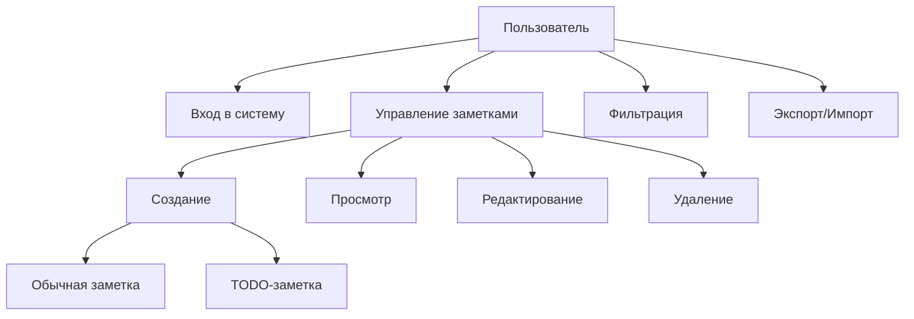
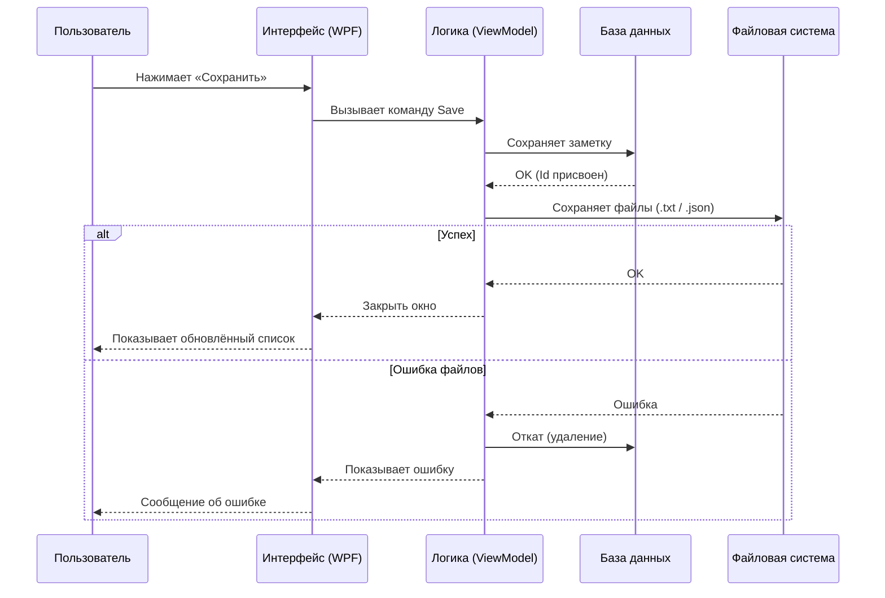

* **Диаграмма вариантов использования (Use Case):** 

```mermaid
graph TD
    A[Пользователь] --> B[Вход в систему]
    A --> C[Управление заметками]
    A --> D[Фильтрация]
    A --> E[Экспорт/Импорт]

    C --> F[Создание]
    C --> G[Просмотр]
    C --> H[Редактирование]
    C --> I[Удаление]

    F --> J[Обычная заметка]
    F --> K[TODO-заметка]
```

* **Диаграмма последовательности (Sequence) взаимодействия модулей:**

```mermaid
sequenceDiagram
    participant User as Пользователь
    participant UI as Интерфейс (WPF)
    participant Logic as Логика (ViewModel)
    participant DB as База данных
    participant FS as Файловая система

    User->>UI: Нажимает «Сохранить»
    UI->>Logic: Вызывает команду Save
    Logic->>DB: Сохраняет заметку
    DB-->>Logic: OK (Id присвоен)
    Logic->>FS: Сохраняет файлы (.txt / .json)
    alt Успех
        FS-->>Logic: OK
        Logic-->>UI: Закрыть окно
        UI-->>User: Показывает обновлённый список
    else Ошибка файлов
        FS-->>Logic: Ошибка
        Logic->>DB: Откат (удаление)
        Logic-->>UI: Показывает ошибку
        UI-->>User: Сообщение об ошибке
    end
```